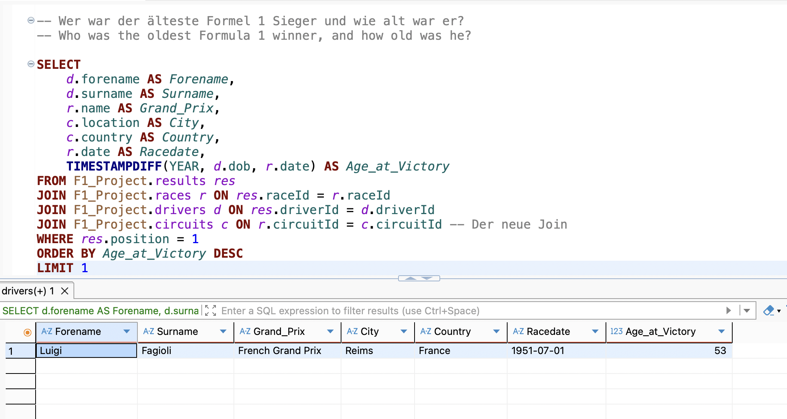
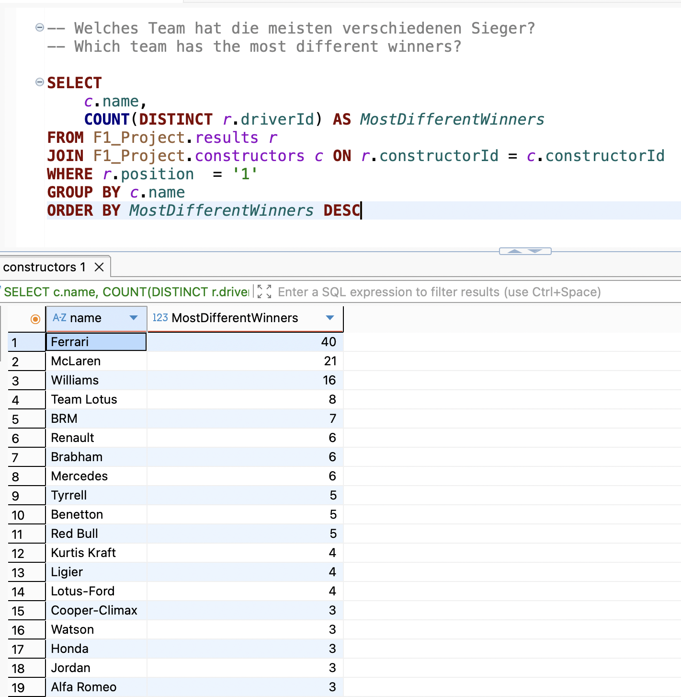
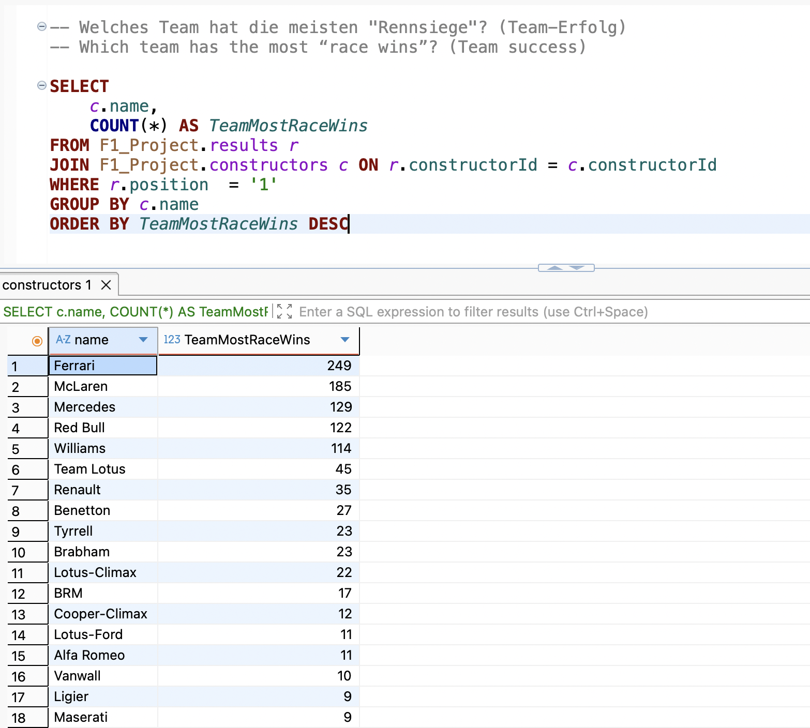
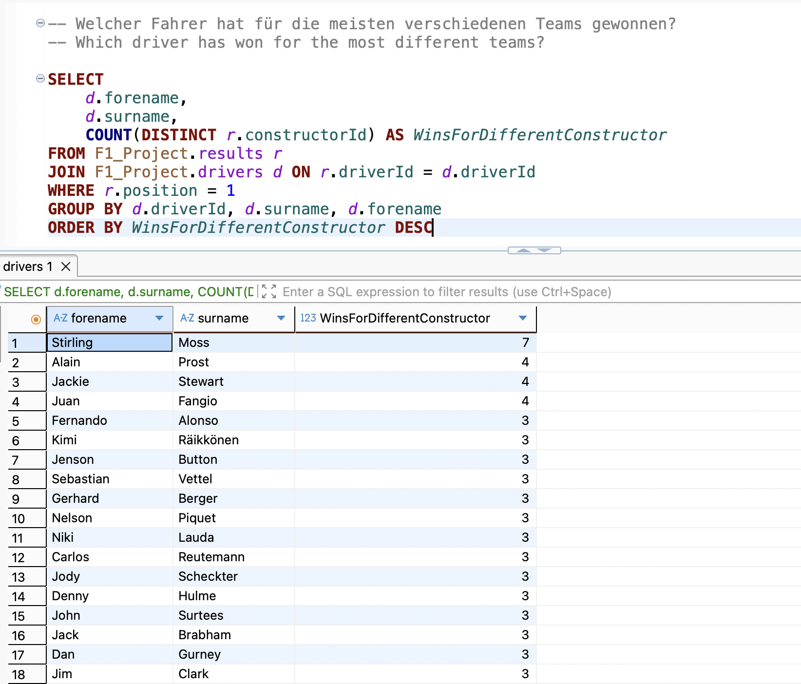

# Formula 1 Data Analysis - SQL Portfolio Project

In this project, I analyzed over 70 years of Formula 1 history.

In diesem Projekt habe ich über 70 Jahre Formel 1 Geschichte analysiert. 

## Project Overview
In this project, I used the Formula 1 dataset from over 70 years to analyze historical race data. My goal was to use SQL queries to gain deeper insights into the world of Formula 1.

In diesem Projekt habe ich das Formel 1 Dataset von über 70 Jahren genutzt um historische Renndaten zu analysieren. Mein Ziel war es SQL-Abfragen zu nutzen um einen tieferen Einblick in die Formel 1 Welt zu gewinnen. 

## Key Insights 
### The highlights of my analysis were: 

Calculating the age of the winners at the time of the race using “TIMESTAMPDIFF”

Identifying the drivers who have won for the most different teams using “(COUNT(DISTINCT))”

Joining four tables “(results, races, drivers, circuits)” to map the wins geographically. 

### Meine Highlights der Analyse waren: 

Die Berechnung des Alters der Sieger zum Zeitpunkt des Rennens mittels "TIMESTAMPDIFF"

Identifizierung von Fahrern, die für die meisten unterschiedlichen Teams gewonnen haben mit "(COUNT(DISTINCT))"

Verknüpfung von vier Tabellen "(results, races, drivers, circuits)" um die Siege geografisch zuzuordnen.

### Visual Insights

#### 1. Oldest Winner

#### 2. Team with most Different Winners

#### 3. Team with most Race Wins

#### 4. Driver with Wins for most Different Teams

## Technical Skills
SQL: MySQL

Tools: dBeaver

Concepts: Multi-table joins (inner joins), aggregate functions (SUM, COUNT, AVG), date arithmetic, filtering & sorting (GROUP BY, HAVING, ORDER BY).

Konzepte: Multi-Table Joins (Inner Joins), Aggregatfunktionen (SUM, COUNT, AVG), Datumsarithmetik, Filterung & Sortierung (GROUP BY, HAVING, ORDER BY).

## Data Source & Credits
Data Source: https://www.kaggle.com/datasets/rohanrao/formula-1-world-championship-1950-2020

Youtube: https://www.youtube.com/watch?v=PSNXoAs2FtQ

### Credits:

This project was inspired by the SQL tutorial from FreeCodeCamp and Alex the Analyst. I used the fundamentals presented there to develop my own, more complex analyses and logic (such as the age calculations).

Dieses Projekt wurde inspiriert durch das SQL-Tutorial von freecodecamp & Alex the Analyst. Ich habe die dort gezeigten Grundlagen genutzt, um eigene, komplexere Analysen und Logiken (wie die Altersberechnungen) zu entwickeln.
